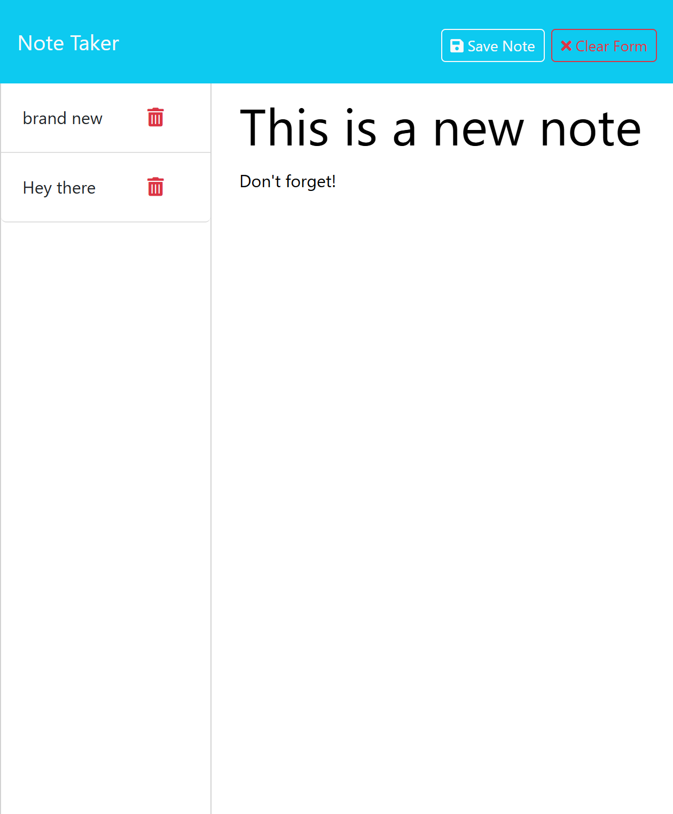

# challenge-11-notes

## Description

This application uses express to manage a note taking app. It demonstrates the get, post, and delete functions.

Deployed Website:
[Note Taker App](https://challenge-11-notes.onrender.com/notes)

## Usage

You can use this app to track and manage notes. When you add a new note it appears in the side bar, allowing you to crate a to do list, schedule, or shopping list. When you no longer need the note, you can click the delete button to remove it. 

Example image:

 

## Credits

This is modified starter code from edex challenge 11. I also used the xpert learning assistant to clean up and repair my code. 

